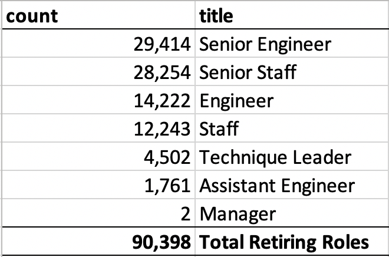

# **Module7-Pewlett-Hackard-Analysis**
# **SQL using PostgreSQL and pgAdmin**

## **Overview of the Analysis**

### As "baby boomers" age employees are beginning to retire at a rapid rate, Pewlett Hackard needs to prepare retirement package offerings for those who qualified and to find out which positions will need to be filled in the near future, so the company can begin to prepare succession planning and knowledge transfer process as the retiring employees will be passing the torch to the younger generation.

### In this analysis we created tables that show:
### *   List of retiring employees and their titles.
### *   Count of retiring employees by titles.
### *   List of employees who are eligible to participate in a mentorship program.

## **Results**

### The SQL codes for this analysis can be seen here:

[Employee_Database_Challenge.sql](https://github.com/davidzachie/Module7-Pewlett-Hackard-Analysis/blob/1984a9488316572f3318e7cd954ba897c86632ec/Queries/Employee_Database_Challenge.sql)

### Table that contains unique employee number list of retiring employees, their names, and titles can be used to prepare retirement package offerings and can be seen here:

[unique_titles.csv](https://raw.githubusercontent.com/davidzachie/Module7-Pewlett-Hackard-Analysis/main/Data/unique_titles.csv)
    
### Table that contains count of retiring employees by titles provides the company with the numbers of potential future vacant positions and job types that will need to be filled can be seen here:

[retiring_titles.csv](https://github.com/davidzachie/Module7-Pewlett-Hackard-Analysis/blob/1984a9488316572f3318e7cd954ba897c86632ec/Data/retiring_titles.csv)

### Table that shows the list of employees who are eligible to participate in a mentorship program to help the company preparing succession planning and knowledge transfer process can be seen here:
    
[mentorship_eligibility.csv](https://github.com/davidzachie/Module7-Pewlett-Hackard-Analysis/blob/1984a9488316572f3318e7cd954ba897c86632ec/Data/mentorship_eligibility.csv)
    
### Four major points from this analysis:
### *  Almost a third of the retirees are Senior Engineers and another third are other       Senior Staff.
### *  Therefore, Senior Engineer and Senior Staff positions have the highest priority       when it comes to deciding which roles the company need to fill.
### *  From 90,398 people who are retiring, only 1,549 employees are qualifies for the       mentorship program.
### *  This means there are more employees retiring than there are potential mentors.        Therefore the company needs to create broader and more efficient succession and       knowledge transfer programs to overcome the disparity between the number of           retiring employees and the number of mentors who can help with training to fill       future vacant positions.

## **Summary**
    
### Number of roles that will need to be filled as the "silver tsunami" begins to make an impact:

### Are there enough qualified, retirement-ready employees to mentor the next generation of employees?

### Looking at the current projection of potential mentors and the number of people retiring, we do not have enough retirees to mentor the next generation of employees.

 Moving forward, we can create a query that gives us a list of people who are retiring at the end of the current year (and for each following year). From there, the company can prioritize how many younger employees need to be trained to fill up the retired positions. It would also be beneficial if we created a query that grouped mentor-eligible employees into position titles. With this table, the company can plan the mentorship program, specifically, how many mentees a mentor can take on to fulfill the retired roles.

    
    

